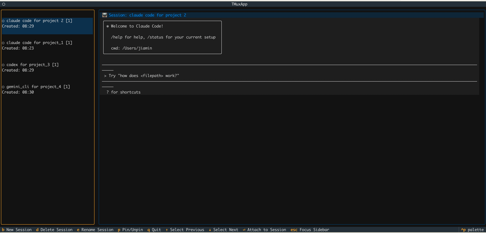

# async-ai-engineer⚡

**A Modern Terminal Multiplexer for AI Development Workflows**

async-ai-engineer is a powerful terminal management system designed specifically for AI engineers and developers. Built with Python and Textual, it enables you to run multiple AI tools concurrently while maintaining full control over your development workflow. Switch between Claude Code sessions, Codex instances, and Gemini CLI tools seamlessly - all while AI responses are processing in the background.




## Features

- 🤖 **Multi-AI Support**: Concurrent management of Claude Code, Codex, Gemini CLI, and other AI tools
- ⚡ **Async Workflow**: Continue working while AI tools process in the background
- 🎯 **Session Management**: Create, switch, and organize multiple AI development sessions
- 📊 **Real-time Monitoring**: Live status updates for all running AI processes
- ⌨️ **Keyboard Navigation**: Vim-like keybindings for lightning-fast workflow switching
- 🎨 **Modern UI**: Clean, responsive interface optimized for AI development
- 🔄 **Auto-refresh**: Automatic updates of AI tool status and responses
- 📋 **Process Details**: Monitor AI tool activity, response times, and session health
- 🚀 **High Performance**: Optimized for handling multiple concurrent AI processes

## Quick Start

### Installation

```bash
# Clone the repository
git clone <repository-url>
cd async-ai-engineer

pip install -e .
```

### Usage

```bash
aai
```


## Why async-ai-engineer?
Traditional terminal workflows force you to wait for AI responses, breaking your development flow. async-ai-engineer changes this by:

- Running AI tools in parallel background processes
- Allowing seamless task switching during AI processing
- Maintaining context across multiple AI conversations
- Providing a unified interface for diverse AI development tools

Perfect for AI engineers who need to juggle multiple AI-assisted coding tasks, prompt engineering workflows, and development processes simultaneously.